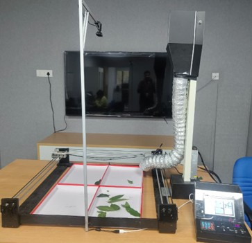

# Smart Automated Feeding & Environmental Monitoring System for Sericulture

> A CNC-controlled, image-processing-driven automated feeding system for silkworm rearing, integrated with IoT environmental monitoring and cloud connectivity. Patent application in progress.


---

# 🐛 Problem Statement

Traditional silkworm farming (sericulture) requires manual feeding of mulberry leaves multiple times per day. Over-feeding wastes expensive leaves, while under-feeding stunts silkworm growth. Environmental factors like temperature and humidity also directly impact silk yield, but are rarely monitored continuously. This project automates both feeding and environmental control, eliminating manual intervention entirely.

<p align="center">
  
</p>

<p align="center">
Complete prototype of the smart automated feeding and environmental monitoring system for sericulture.
</p>

---

# ✨ Key Features

- Image-based feeding trigger: Raspberry Pi camera captures the feeding tray; feeding only occurs when leaf quantity drops below threshold
- CNC-controlled leaf dispensing: G-code-driven stepper motor mechanism delivers precise leaf portions — no wasted leaves
- Peltier-based leaf preservation: Keeps stored mulberry leaves fresh by maintaining a cool, controlled storage environment
- Environmental monitoring: DHT11 sensor tracks temperature and humidity in the rearing chamber; actuates heater, cooler, and humidifier as needed
- IoT cloud connectivity: ESP32 + Blynk enables remote monitoring, real-time alerts, and manual override from any mobile device
- Solar-powered: Ensures uninterrupted operation in farm settings without stable grid power

---

# 🏗️ System Architecture

The system uses a three-controller layered architecture:

```text
┌─────────────────────────────────────────────────────────┐
│                    LAYER 1: VISION & DECISION            │
│         Raspberry Pi 4 — Image Processing + Control      │
│   Camera Module → OpenCV leaf detection → Feed decision  │
└──────────────────────────┬──────────────────────────────┘
                           │ Serial / GPIO
┌──────────────────────────▼──────────────────────────────┐
│                   LAYER 2: MOTION CONTROL                │
│         Arduino + CNC Shield — Stepper Motor Control     │
│   Receives G-code from Pi → Drives X-Y feeder mechanism  │
└──────────────────────────┬──────────────────────────────┘
                           │
┌──────────────────────────▼──────────────────────────────┐
│               LAYER 3: ENVIRONMENT & IoT                 │
│     ESP32 — DHT11 sensing + Peltier control + Blynk      │
│   Monitors temp/humidity → actuates cooling/heating      │
│   Sends telemetry to cloud → Receives remote commands    │
└─────────────────────────────────────────────────────────┘
```

<p align="center">
  
</p>

<p align="center">
Block diagram illustrating Raspberry Pi vision processing, Arduino CNC control, ESP32 environmental monitoring, and IoT cloud integration.
</p>

<p align="center">
  
</p>

<p align="center">
System workflow showing image capture, leaf detection, automated dispensing, environmental monitoring, and cloud reporting sequence.
</p>

---

# 🔧 Hardware Components

| Component | Purpose |
|-----------|---------|
| Raspberry Pi 4 | Central controller: image processing and feeding decisions |
| Arduino Uno | CNC shield driver: controls stepper motors for feeder |
| ESP32 | Environmental sensing, Peltier control, cloud connectivity |
| CNC Shield + NEMA Stepper Motors | XY-axis leaf dispensing mechanism |
| Camera Module | Captures feeding tray for leaf quantity detection |
| DHT11 Sensor | Monitors temperature and humidity in rearing chamber |
| Peltier Module + Heat Sink + Fan | Leaf preservation cooling unit |
| Relay Module | Automated switching for heater, cooler, humidifier |
| Blynk Cloud | IoT platform for remote monitoring and manual override |
| Joystick | Manual override for local control |
| Solar Panel + BMS | Renewable power source for off-grid operation |

---

# ⚙️ How It Works (Step by Step)

1. Capture — Raspberry Pi camera takes an image of the silkworm feeding tray at regular intervals.
2. Detect — OpenCV processes the image to estimate remaining leaf quantity.
3. Decide — If leaves are below threshold, Raspberry Pi triggers a feeding cycle.
4. Dispense — Arduino drives the CNC stepper motors to deliver a measured portion of mulberry leaves.
5. Preserve — ESP32 monitors the leaf storage unit and maintains the Peltier cooling system to keep leaves fresh.
6. Monitor — ESP32 reads DHT11 temperature and humidity, actuates environmental controls to keep the rearing chamber optimal.
7. Report — All data is streamed to Blynk cloud; alerts are sent if parameters go out of range.
8. Override — User can manually control feeding or environmental systems via the Blynk app or the onboard joystick.

<p align="center">
  
</p>

<p align="center">
Microcontroller integration setup containing Raspberry Pi, Arduino Uno, and CNC shield.
</p>

<p align="center">
  
</p>

<p align="center">
Dispensing mechanism used for automated and precise silkworm feeding.
</p>

---

# 📊 Results

- ✅ Successfully automated full feeding cycles with camera-triggered dispensing
- ✅ Environmental parameters accurately monitored and maintained in real-time
- ✅ Peltier system effectively preserved leaf freshness in storage unit
- ✅ Cloud telemetry consistently transmitted to Blynk dashboard
- ✅ Improved resource efficiency and significantly reduced manual intervention

---

# 🔮 Future Scope

- AI-based silkworm health and disease detection using computer vision
- Advanced instar-stage recognition to adjust leaf quantity per growth phase
- Large-scale cloud dashboard with multi-farm monitoring
- Integration with predictive models for silk yield estimation
- Adaptable for other agricultural automation applications (poultry, aquaculture)

---

# ⚠️ Known Limitations

- Initial hardware setup cost is relatively high for small farmers
- Requires stable internet connection for cloud features
- Image processing accuracy depends on consistent lighting conditions
- Regular mechanical maintenance needed for the CNC feeder components

---

# 📄 IP Status

Patent application in progress for the novel CNC-driven feeding mechanism with environmental feedback loop.

---

# 👥 Team — Spatika

| Name |
|------|
| Sri Srujan Hari T |
| Tarun Patil |
| Nitish K S |
| Harshitha K V |
